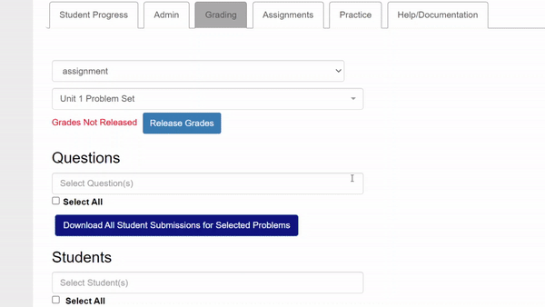

# Runestone Submission Downloader

[](https://github.com/KentoNishi/runestone-submission-downloader/actions/workflows/release.yaml)

Download all Runestone student submissions at once as a zip! Made for Mr. Mark Kwong at Lynbrook ([@psmaker](https://github.com/psmaker)).



## Download
[Download for Chrome from GitHub Releases](https://github.com/KentoNishi/runestone-submission-downloader/releases)

## Development
```bash
yarn       # install dependencies
yarn dev   # development build
yarn build # production build
```